# Panduan Pengguna Aplikasi Chiby Chiby Store

**Versi:** 1.0
**Platform:** Android (min. API 23 / Android 6.0, target API 35)
**Bahasa:** Indonesia

> Semua tangkapan layar di dokumen ini dihasilkan otomatis dari kode UI terkini. Lihat [README.md](README.md) untuk galeri lengkap semua halaman.

---

## Daftar Isi

1. [Pendahuluan](#1-pendahuluan)
2. [Instalasi dan Setup](#2-instalasi-dan-setup)
3. [Memulai Aplikasi](#3-memulai-aplikasi)
4. [Peran Pengguna dan Izin](#4-peran-pengguna-dan-izin)
5. [Navigasi Aplikasi](#5-navigasi-aplikasi)
6. [Manajemen Inventori](#6-manajemen-inventori)
7. [Point of Sale (POS)](#7-point-of-sale-pos)
8. [Riwayat Penjualan](#8-riwayat-penjualan)
9. [Laporan dan Analitik](#9-laporan-dan-analitik)
10. [Manajemen Barcode](#10-manajemen-barcode)
11. [Backup dan Restore](#11-backup-dan-restore)
12. [Manajemen Pengguna](#12-manajemen-pengguna)
13. [Pengaturan](#13-pengaturan)
14. [Penyelesaian Masalah](#14-penyelesaian-masalah)
15. [FAQ](#15-faq)
16. [Kontak Dukungan](#16-kontak-dukungan)

---

## 1. Pendahuluan

### 1.1 Apa itu Chiby Chiby Store?
Chiby Chiby Store adalah aplikasi Point of Sale (POS) lengkap untuk toko retail yang beroperasi secara offline-first. Aplikasi ini dirancang khusus untuk toko retail kecil hingga menengah di Indonesia dengan fitur-fitur lengkap untuk manajemen inventori, penjualan, pelaporan, dan keuangan.

### 1.2 Fitur Utama
- ✅ **Offline-First**: Beroperasi tanpa koneksi internet
- ✅ **Multi-User**: Sistem peran dengan izin berbeda (Owner, Manager, Cashier, Warehouse)
- ✅ **Inventory Management**: Pelacakan stok real-time dengan multi-gudang
- ✅ **Point of Sale**: Antarmuka POS dengan pemindaian barcode
- ✅ **Financial Reporting**: Laporan keuangan lengkap dengan ekspor PDF
- ✅ **Barcode Management**: Generate dan scan barcode GS1 Indonesia
- ✅ **Backup & Restore**: Cadangkan data dengan enkripsi AES256
- ✅ **Thermal Printer**: Dukungan printer struk dan label Bluetooth

### 1.3 Persyaratan Sistem
- **Android**: Versi 6.0 (API 23) atau lebih tinggi
- **Storage**: Minimal 100MB ruang kosong
- **Kamera**: Untuk pemindaian barcode (opsional)
- **Bluetooth**: Untuk printer thermal (opsional)

---

## 2. Instalasi dan Setup

### 2.1 Mengunduh Aplikasi
1. Buka Google Play Store di perangkat Android Anda
2. Cari "Chiby Chiby Store"
3. Klik "Install" dan tunggu proses pengunduhan selesai

### 2.2 Setup Pertama Kali
1. **Buka Aplikasi**: Klik ikon aplikasi setelah instalasi selesai
2. **Data Seeding**: Aplikasi akan secara otomatis membuat data contoh:
   - User default: `owner` (password: `owner123`)
   - Kategori produk: Makanan, Minuman, Pakaian, Elektronik
   - Gudang: Jakarta dan Bandung
   - Produk contoh dengan barcode
3. **Login**: Masuk dengan akun owner untuk setup awal

### 2.3 Izin Aplikasi
Aplikasi memerlukan izin berikut:
- **Kamera**: Untuk pemindaian barcode
- **Storage**: Untuk backup dan restore data
- **Bluetooth**: Untuk koneksi printer thermal

---

## 3. Memulai Aplikasi

### 3.1 Login
1. Masukkan **username** dan **password**
2. Klik tombol "Masuk"
3. Aplikasi akan mengarahkan ke dashboard sesuai peran Anda

### 3.2 Logout
1. Buka menu drawer (klik ikon menu di kiri atas)
2. Scroll ke bawah dan klik "Logout"
3. Konfirmasi logout dengan klik "Ya"

---

## 4. Peran Pengguna dan Izin

### 4.1 Owner (Pemilik)
**Izin Lengkap:**
- Semua fitur aplikasi
- Manajemen pengguna
- Backup dan restore
- Semua laporan keuangan
- Konfigurasi sistem

### 4.2 Manager (Manajer)
**Izin:**
- Laporan penjualan dan keuangan
- View dan edit inventori
- Approval pengeluaran
- Tidak bisa hapus data atau ubah konfigurasi

### 4.3 Cashier (Kasir)
**Izin:**
- Point of Sale (POS)
- View riwayat penjualan harian
- Input manual penjualan
- Tidak bisa edit inventori atau laporan

### 4.4 Warehouse Staff (Staff Gudang)
**Izin:**
- Manajemen inventori (add, edit, transfer)
- Manajemen gudang dan lokasi
- Print label barcode
- View laporan inventori

---

## 5. Navigasi Aplikasi

### 5.1 Struktur Navigasi
Aplikasi menggunakan satu `NavHost` dengan halaman **Login** sebagai titik awal. Setelah login, halaman **Dashboard** menjadi pusat navigasi:

- **Dashboard**: Ringkasan penjualan hari ini, tren 7 hari, dan transaksi terakhir
- **Inventory**: Manajemen produk dan stok
- **Point of Sale**: Antarmuka kasir
- **Sales History**: Riwayat penjualan
- **Reports**: Laporan dan analitik
- **Settings**: Pengaturan aplikasi

Halaman lain (warehouse, pembelian, promosi, pelanggan, kas, stok opname, expense, backup, user, pemasok) dibuka dari Dashboard atau dari halaman terkait.

### 5.2 Drawer Menu (Menu Samping)
Komponen drawer (`AppDrawer`) berisi daftar lengkap menu:
- **Point of Sale**: Antarmuka kasir
- **Manajemen Pembelian**: Purchase order
- **Manajemen Warehouse**: Multi-gudang management
- **Manajemen Expense**: Pengeluaran operasional
- **Manajemen User**: Kelola user (Owner only)
- **Manajemen Promosi**: Diskon dan promo
- **Manajemen Pelanggan**: Data pelanggan
- **Manajemen Kas**: Shift kasir
- **Stok Opname**: Audit stok fisik
- **Barcode Scanner**: Pemindaian barcode
- **Cetak Label Barcode**: Generate label
- **Backup & Restore**: Cadangkan data

> Catatan: komponen drawer dan bottom navigation tersedia di codebase namun belum dipasang di `AppNavigation`. Untuk saat ini navigasi antar halaman dilakukan dari tombol/menu di dalam masing-masing halaman.

| Login | Dashboard |
| --- | --- |
| 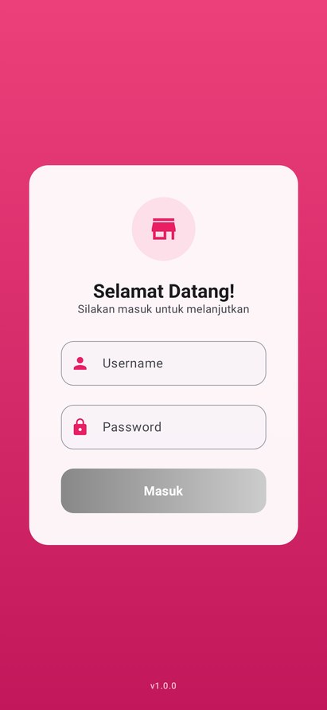 | 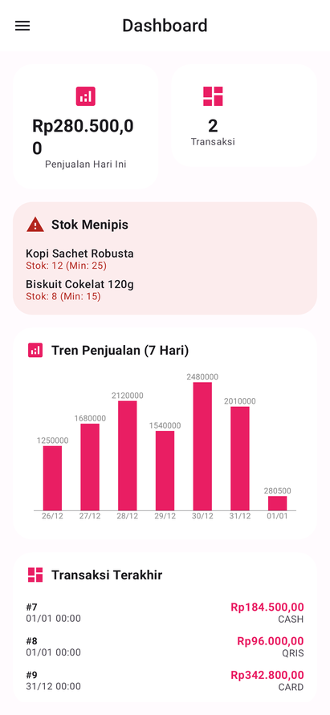 |

---

## 6. Manajemen Inventori

### 6.1 Melihat Inventori
1. Buka halaman **Inventory**
2. **Search**: Gunakan search bar untuk cari produk
3. **Filter**: Klik ikon filter untuk filter berdasarkan kategori
4. **Low Stock Alert**: Produk dengan stok rendah ditandai merah

| Daftar Inventory | Tambah Produk | Detail Produk |
| --- | --- | --- |
| 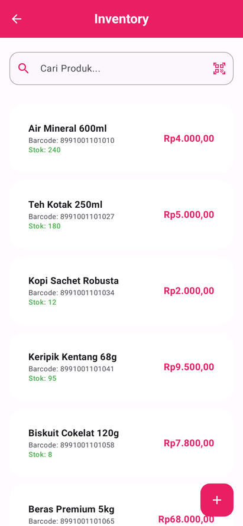 | 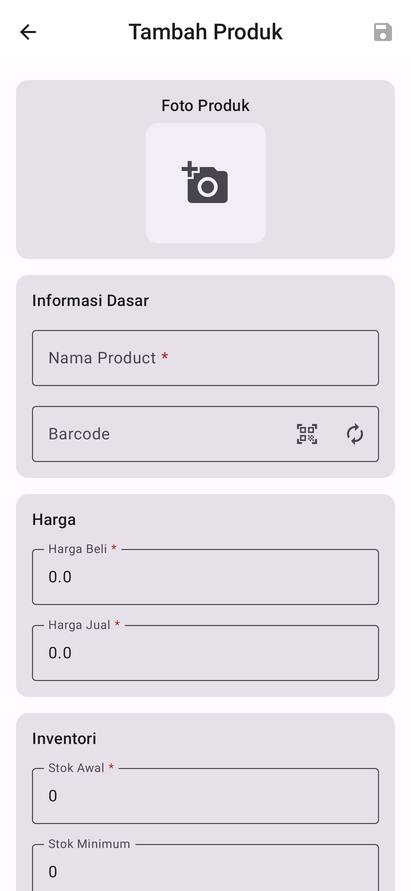 | 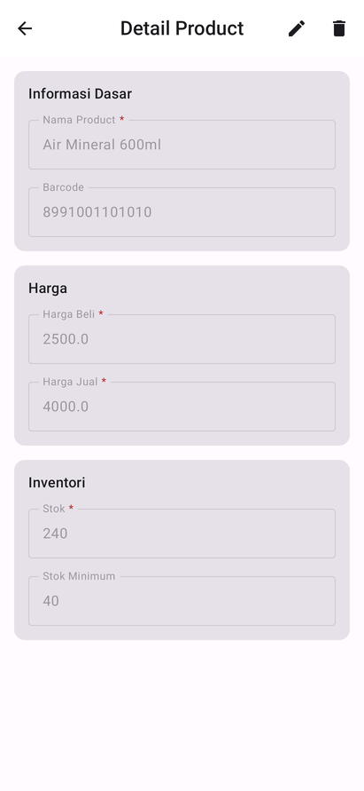 |

### 6.2 Menambah Produk Baru
1. Di halaman Inventory, klik tombol **"+"** (Add Product)
2. Isi detail produk:
   - **Nama**: Nama produk
   - **Barcode**: Scan atau input manual
   - **Kategori**: Pilih dari dropdown
   - **Harga Beli**: Harga pembelian
   - **Harga Jual**: Harga penjualan
   - **Stok**: Jumlah awal
   - **Gudang**: Lokasi penyimpanan
3. Klik "Simpan"

### 6.3 Edit Produk
1. Di halaman Inventory, klik produk yang ingin diedit
2. Klik tombol "Edit" di kanan atas
3. Ubah detail yang diperlukan
4. Klik "Simpan" untuk menyimpan perubahan

### 6.4 Update Stok
1. Klik produk di inventory list
2. Di halaman detail, klik "Update Stok"
3. Masukkan jumlah penambahan/pengurangan
4. Klik "Simpan"

### 6.5 Transfer Antar Gudang
1. Buka halaman **Manajemen Warehouse**
2. Pilih gudang tujuan
3. Klik produk yang ingin dipindah
4. Klik "Transfer" dan pilih gudang tujuan
5. Masukkan jumlah yang akan dipindah

| Daftar Warehouse | Detail Warehouse | Tambah Warehouse | Edit Warehouse |
| --- | --- | --- | --- |
| 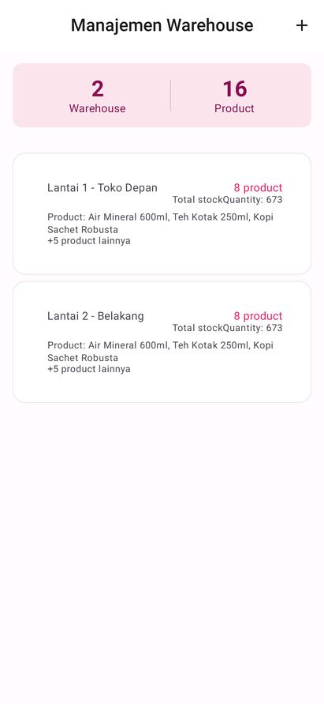 | 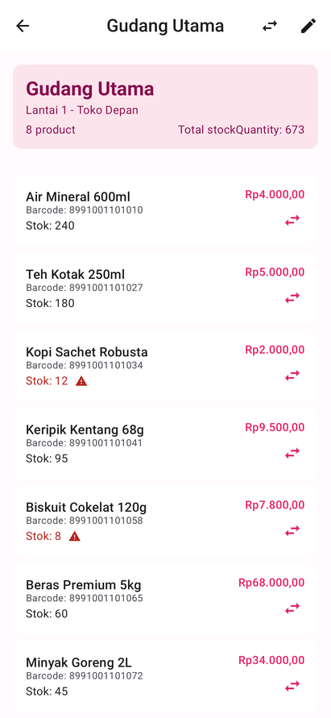 | 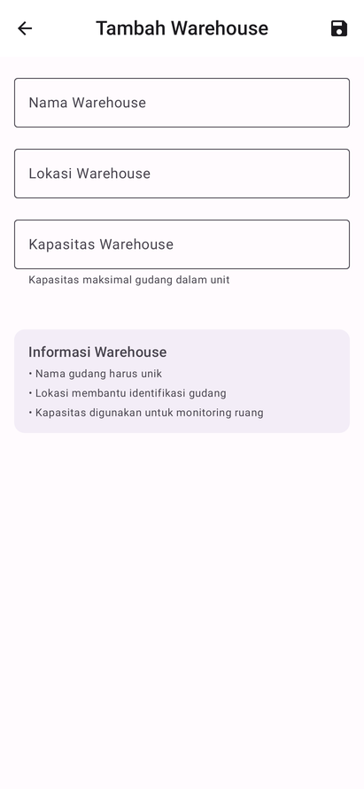 | 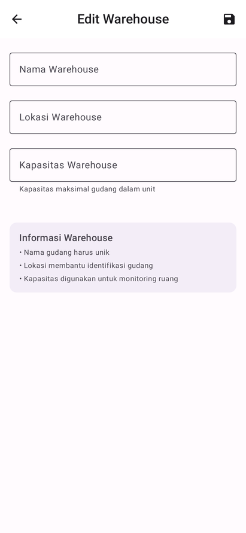 |

---

## 7. Point of Sale (POS)

### 7.1 Memulai Transaksi
1. Buka halaman **Point of Sale**
2. Aplikasi akan menampilkan antarmuka POS dengan:
   - Panel kiri: Pencarian produk
   - Panel kanan: Keranjang dan pembayaran

| Point of Sale | Dialog Struk |
| --- | --- |
| 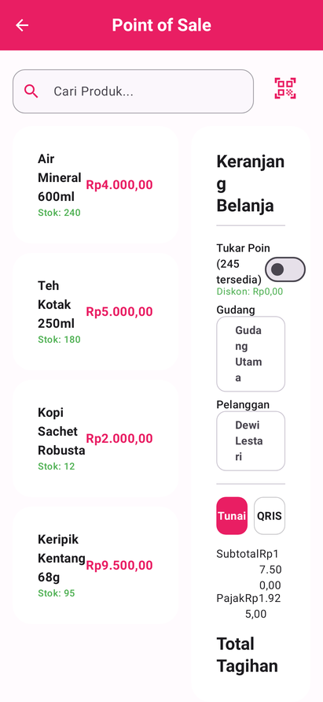 | 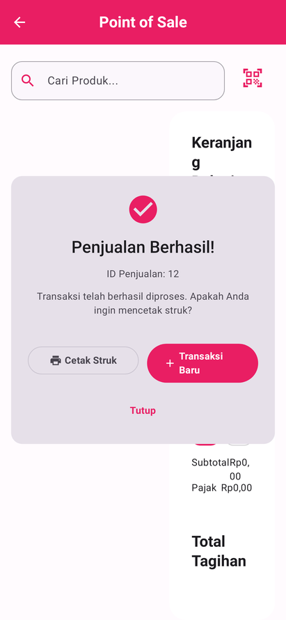 |

### 7.2 Menambah Produk ke Keranjang
**Opsi 1 - Pencarian Manual:**
1. Ketik nama produk di search bar
2. Klik produk dari hasil pencarian
3. Masukkan jumlah
4. Klik "Tambah ke Keranjang"

**Opsi 2 - Scan Barcode:**
1. Klik tombol "Scan Barcode"
2. Izinkan akses kamera
3. Arahkan kamera ke barcode produk
4. Produk otomatis ditambahkan ke keranjang

### 7.3 Mengelola Keranjang
- **Ubah Jumlah**: Klik +/- di samping produk
- **Hapus Item**: Swipe kiri pada item atau klik ikon hapus
- **Diskon**: Klik "Tambah Diskon" dan masukkan persentase
- **Total**: Otomatis terhitung dengan PPN 10%

### 7.4 Proses Pembayaran
1. Pilih metode pembayaran:
   - **Tunai (CASH)**
   - **Kartu (CARD)**
   - **QRIS**
2. Klik "Bayar"
3. Konfirmasi pembayaran
4. Struk ditampilkan di dialog dan bisa dicetak/dibagikan (jika printer tersedia)

---

## 8. Riwayat Penjualan

### 8.1 Melihat Riwayat Penjualan
1. Buka halaman **Sales History**
2. **Filter Tanggal**: Klik ikon kalender untuk filter periode
3. **Search**: Cari berdasarkan nomor struk atau metode pembayaran

| Riwayat Penjualan | Dialog Struk |
| --- | --- |
| 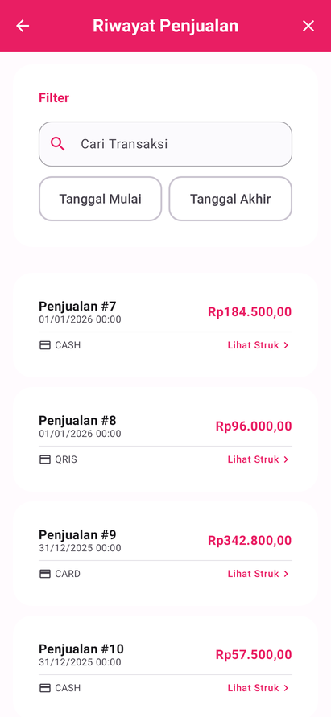 | 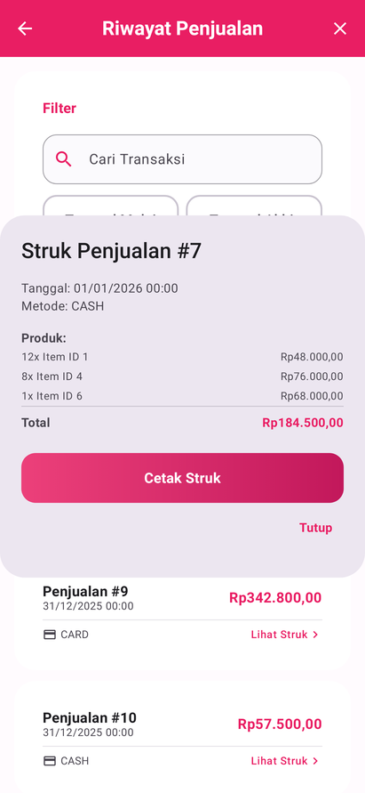 |

### 8.2 Detail Transaksi
1. Klik transaksi dari list
2. Lihat detail:
   - Daftar produk yang dibeli
   - Total, diskon, PPN
   - Metode pembayaran
   - Waktu transaksi

### 8.3 Print Struk Ulang
1. Di halaman riwayat, klik "Lihat Struk" pada transaksi
2. Dialog struk akan tampil
3. Klik tombol "Cetak Struk"
4. Struk dikirim ke printer atau dibagikan sebagai file

### 8.4 Refund
Refund dijalankan di lapisan service (`SaleServiceImpl.refundPenjualan`): transaksi ditandai `isRefunded` dan stok produk dikembalikan. Belum ada tombol refund di UI, jadi saat ini hanya bisa dipicu dari kode/service.

---

## 9. Laporan dan Analitik

### 9.1 Mengakses Laporan
1. Buka halaman **Reports**
2. Pilih tipe laporan dari dropdown "Pilih Tipe Laporan"
3. Atur Tanggal Mulai dan Tanggal Akhir

### 9.2 Tipe Laporan Tersedia
Aplikasi menyediakan 12 tipe laporan:

#### 9.2.1 Penjualan Kotor (Gross Sales)
- Total penjualan dalam periode
- Rata-rata transaksi
- Trend penjualan harian

#### 9.2.2 Margin Keuntungan (Profit Margin)
- Pendapatan vs biaya
- Persentase margin keuntungan
- Breakdown per produk

#### 9.2.3 Keuntungan Bersih (Net Profit)
- Keuntungan kotor - pengeluaran
- Analisis profitabilitas

#### 9.2.4 Penjualan per Produk/Kategori
- Top produk terlaris
- Perbandingan kategori
- Grafik batang interaktif

#### 9.2.5 Trend Penjualan (Sales Trend)
- Grafik garis penjualan harian
- Analisis pola penjualan

#### 9.2.6 Pergerakan Stok (Stock Movement)
- Riwayat masuk/keluar stok per produk
- Referensi transaksi (INV/TRX)

#### 9.2.7 Ringkasan Periodik (Periodic Summary)
- Penjualan dan net profit per hari dalam periode

#### 9.2.8 Laporan Keuangan
- **Neraca (Balance Sheet)**: Aset, liabilitas, ekuitas
- **Arus Kas (Cash Flow)**: Operating, investing, financing
- **Laporan Laba Rugi (Income Statement)**: Pendapatan dan pengeluaran
- **Laporan Expense**: Rekap pengeluaran per kategori

| Gross Sales | Net Profit | Profit Margin | Sales Trend |
| --- | --- | --- | --- |
| 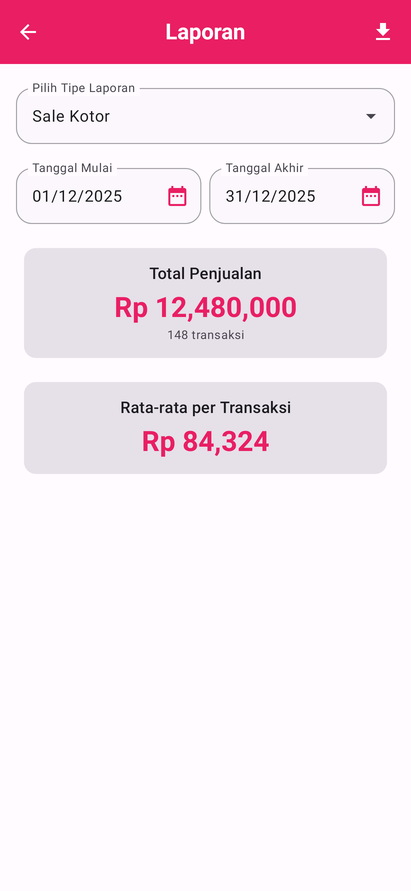 | 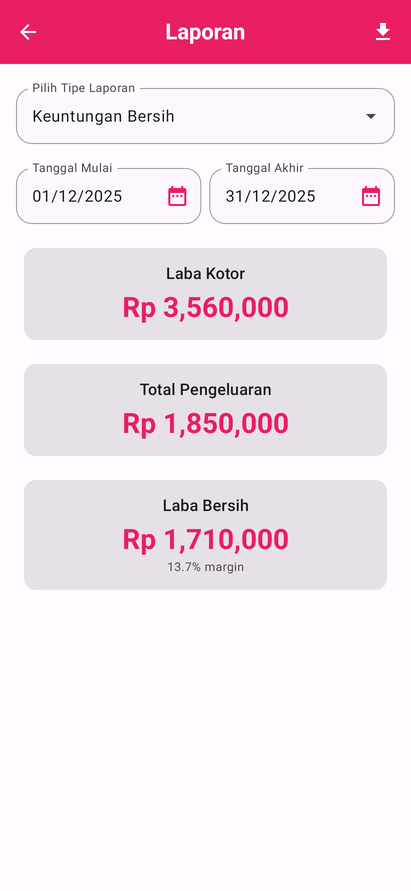 | 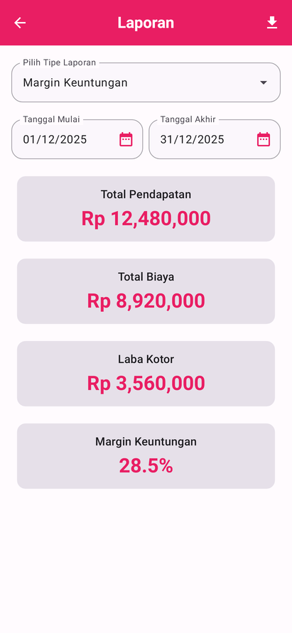 | 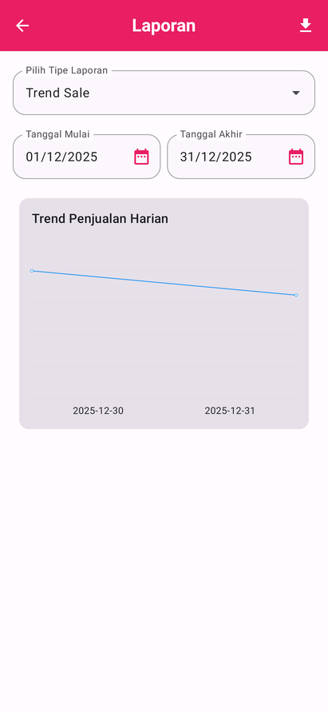 |

| Sales per Produk | Sales per Kategori | Pergerakan Stok | Ringkasan Periodik |
| --- | --- | --- | --- |
| 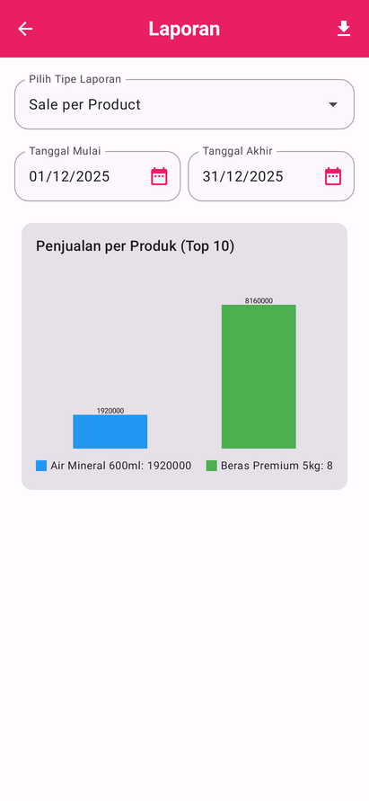 | 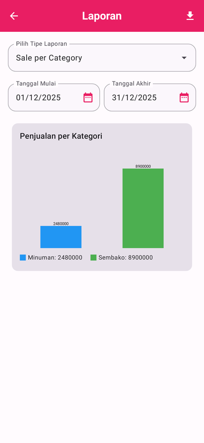 | 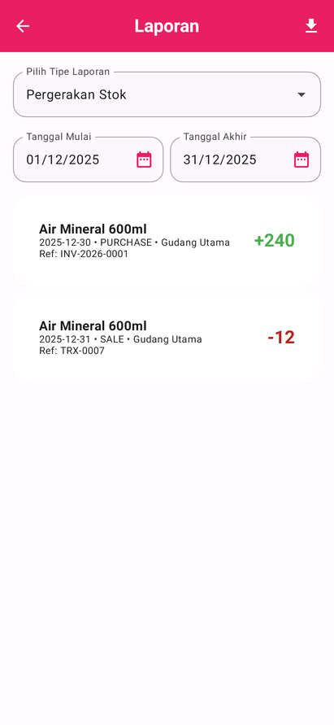 | 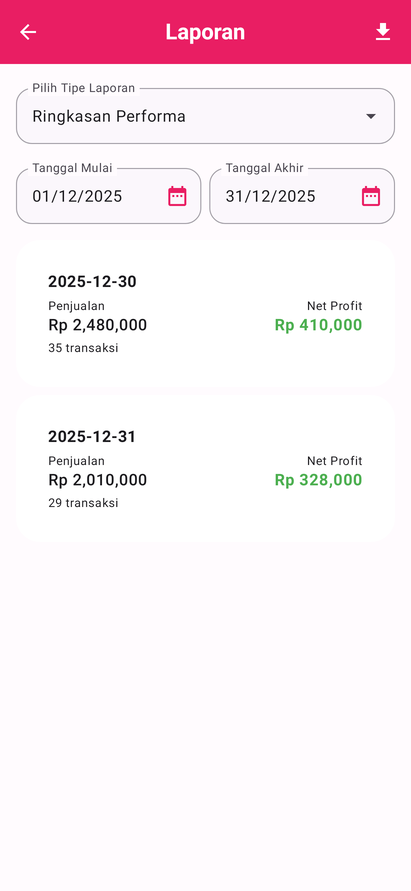 |

| Laba Rugi | Neraca | Arus Kas | Expense |
| --- | --- | --- | --- |
| 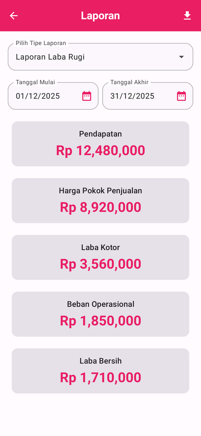 | 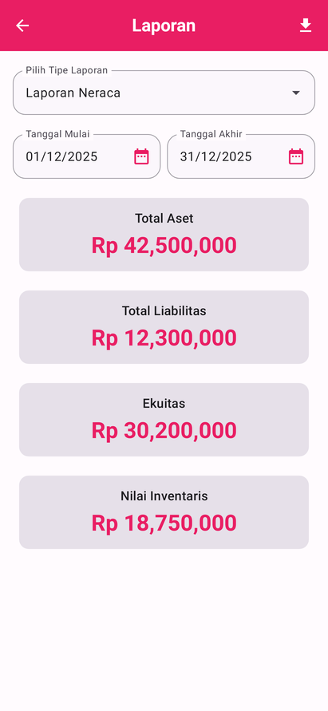 | 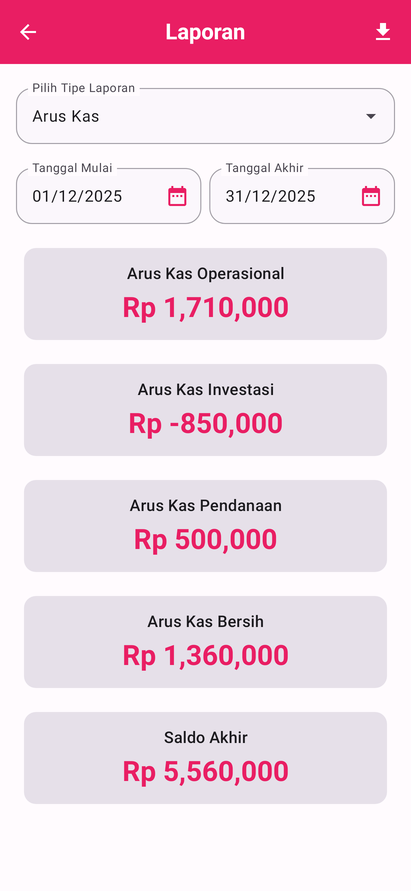 | 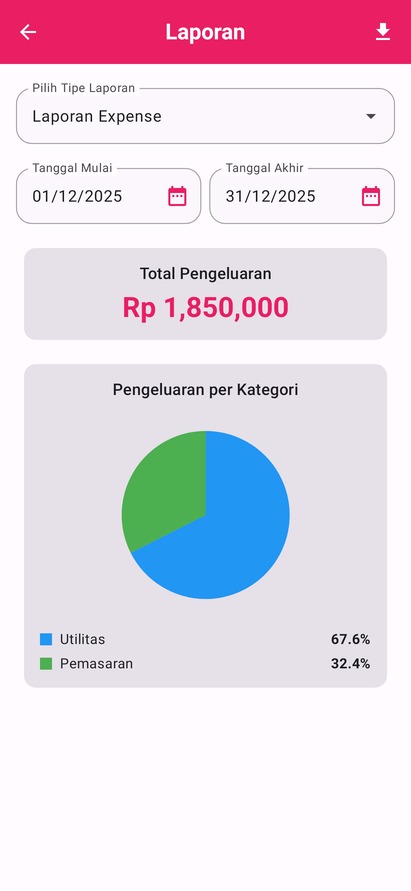 |

### 9.3 Export Laporan
1. Di halaman laporan, klik tombol export
2. Laporan dirender menjadi PDF
3. Muncul pilihan untuk membuka atau membagikan file PDF
4. Bagikan via email, WhatsApp, atau aplikasi lain

---

## 10. Manajemen Barcode

### 10.1 Scan Barcode
1. Buka halaman **Scan Barcode**
2. Izinkan akses kamera
3. Arahkan kamera ke barcode
4. Produk otomatis ditemukan dan ditampilkan

| Scan Barcode | Cetak Label Barcode |
| --- | --- |
| 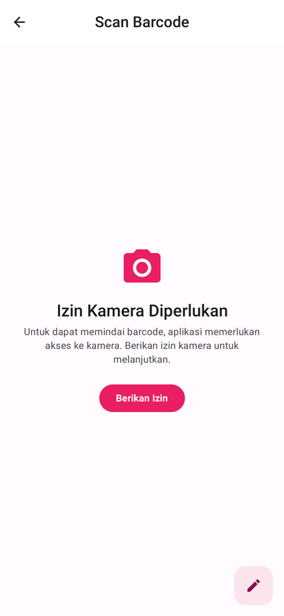 | 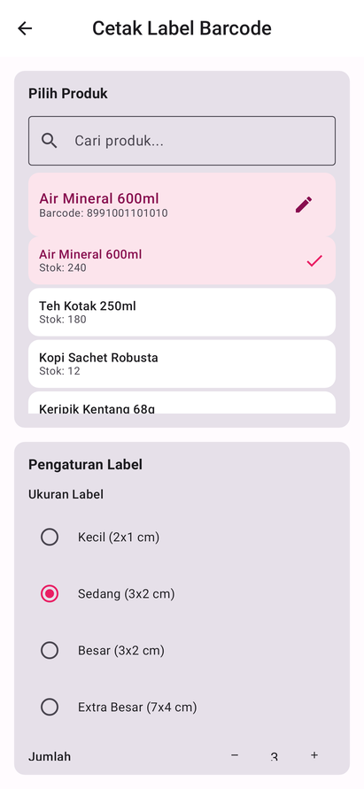 |

### 10.2 Generate Barcode
1. Buka halaman **Cetak Label Barcode**
2. Pilih produk dari list
3. Pilih ukuran label:
   - Kecil (2x1 cm)
   - Sedang (3x2 cm)
   - Besar (3x2 cm)
   - Extra Large (7x4 cm)
4. Masukkan jumlah label
5. Klik "Print" untuk cetak via Bluetooth

### 10.3 Format Barcode
Aplikasi mendukung:
- **EAN-13**: Standar retail Indonesia
- **Code 128**: General purpose
- **QR Code**: 2D barcode
- **GS1 DataMatrix**: Healthcare dan logistik

---

## 11. Backup dan Restore

### 11.1 Membuat Backup
1. Buka halaman **Backup & Restore**
2. Klik "Buat Backup"
3. Tunggu proses backup selesai
4. File backup (.enc) tersimpan di folder `Downloads/ChibyChibyBackup`, terenkripsi AES-256-GCM

### 11.2 Melihat Riwayat Backup
- List semua file backup dengan:
  - Tanggal pembuatan
  - Ukuran file
  - Status integritas

### 11.3 Restore Data
1. Di halaman backup, klik "Restore"
2. Pilih file backup dari storage
3. Klik "Preview" untuk lihat isi backup
4. Klik "Restore" dan konfirmasi
5. Aplikasi akan restart setelah restore

### 11.4 Hapus Backup Lama
1. Swipe kiri pada file backup
2. Klik "Hapus" atau konfirmasi

| Backup & Restore |
| --- |
| 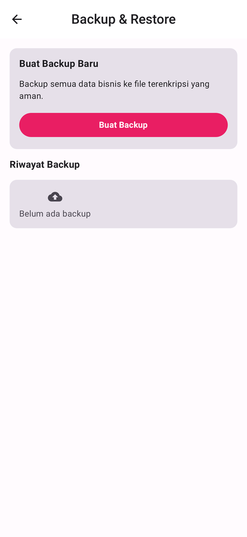 |

---

## 12. Manajemen Pengguna

### 12.1 Menambah User Baru (Owner Only)
1. Buka halaman **Manajemen User**
2. Klik tombol "+" (Add User)
3. Isi detail:
   - Username
   - Password
   - Peran: Owner/Manager/Cashier/Warehouse
4. Klik "Simpan"

### 12.2 Edit User
1. Klik user dari list
2. Klik "Edit"
3. Ubah detail yang diperlukan
4. Klik "Simpan"

### 12.3 Ganti Password
1. Di halaman detail user, klik "Ganti Password"
2. Masukkan password baru
3. Konfirmasi password
4. Klik "Simpan"

| Manajemen User | Tambah User | Detail User | Konfirmasi Hapus |
| --- | --- | --- | --- |
| 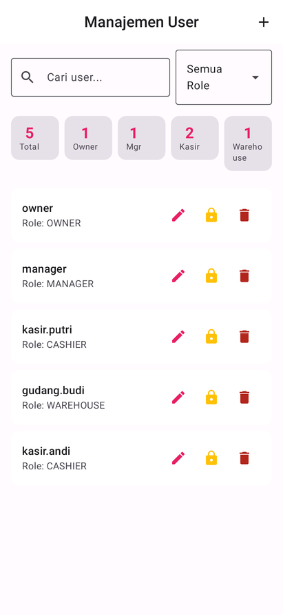 | 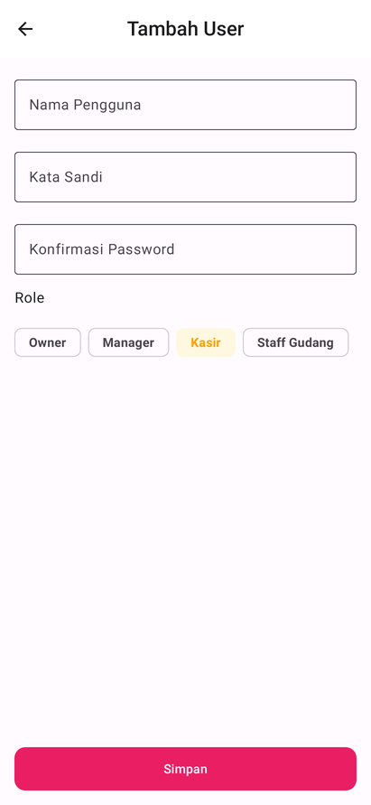 | 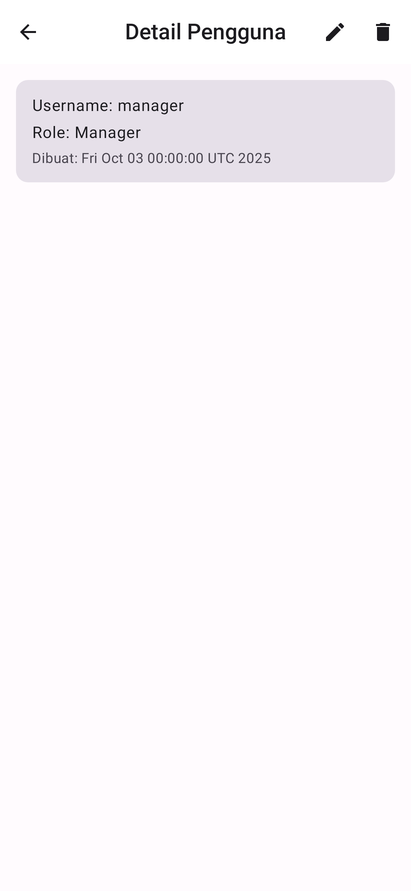 | 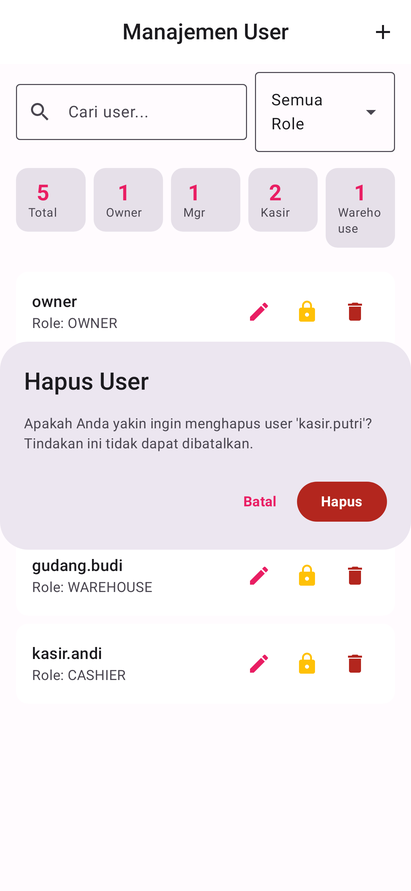 |

---

## 13. Pengaturan

### 13.1 Profile
- Lihat informasi user saat ini
- Ganti password pribadi

### 13.2 Backup
- Akses cepat ke fitur backup
- Lihat status backup terakhir

### 13.3 Tentang Aplikasi
- Versi aplikasi
- Informasi developer
- Link ke dokumentasi

### 13.4 Logout
- Keluar dari aplikasi
- Konfirmasi sebelum logout

| Pengaturan |
| --- |
| 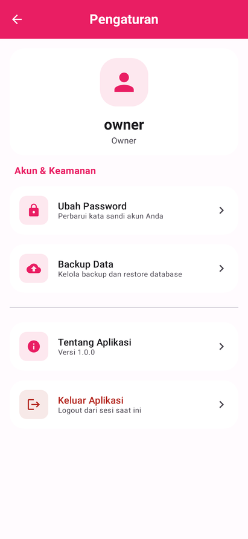 |

### 13.5 Halaman Lainnya

**Pemasok** — daftar supplier dengan pencarian. Tombol "+" membuka dialog tambah pemasok (nama wajib, telepon, email, alamat). Ikon pensil untuk edit, ikon hapus untuk hapus.

**Promosi** — daftar promo beserta status aktif/nonaktif. Form tambah/edit memuat nama, deskripsi, tipe (Persentase atau Nominal Tetap), nilai, minimal belanja, maksimal diskon opsional, dan periode promo.

**Pelanggan** — daftar pelanggan dengan pencarian dan total poin. Form tambah/edit memuat nama, nomor HP, email, dan alamat.

**Kas / Shift** — buka shift dengan modal awal, lalu tutup shift dengan mengisi kas aktual di laci dan catatan; selisih dihitung otomatis. Halaman riwayat menampilkan shift sebelumnya.

**Pembelian** — daftar purchase order. Form pembelian baru memilih pemasok, gudang, dan daftar produk beserta jumlah dan harga beli.

**Stok Opname** — daftar sesi opname. Memulai opname berarti memilih gudang, lalu memasukkan jumlah fisik tiap produk; selisih terhadap stok sistem dicatat dan stok disesuaikan.

**Expense** — daftar pengeluaran dengan filter periode dan kategori. Form tambah memuat jumlah, kategori, tanggal, dan deskripsi. Halaman detail menampilkan rincian dan bisa masuk mode edit.

| Pemasok | Promosi | Pelanggan | Kas / Shift |
| --- | --- | --- | --- |
| 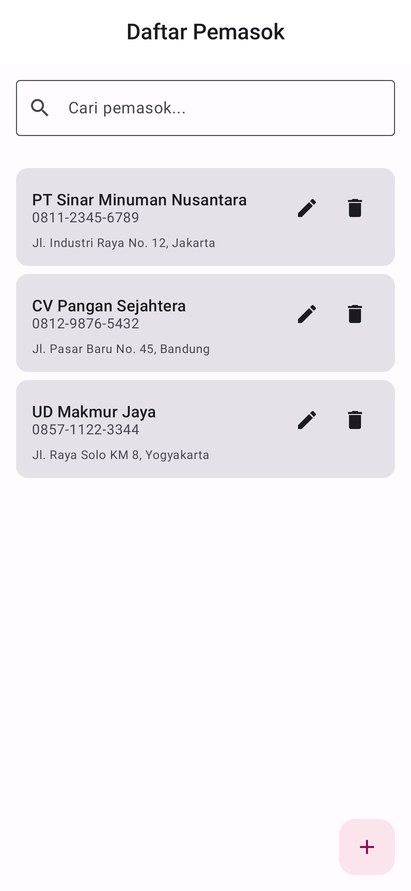 | 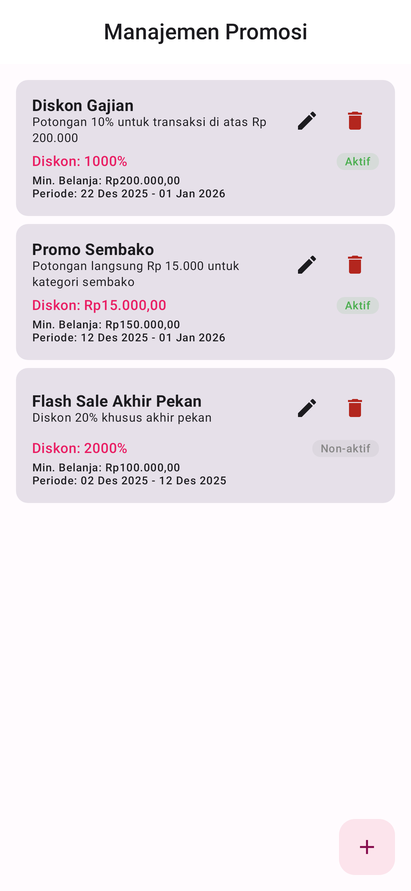 | 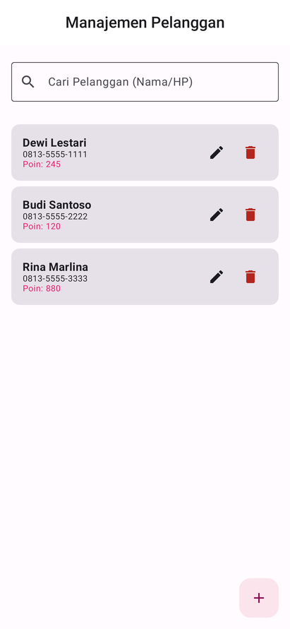 | 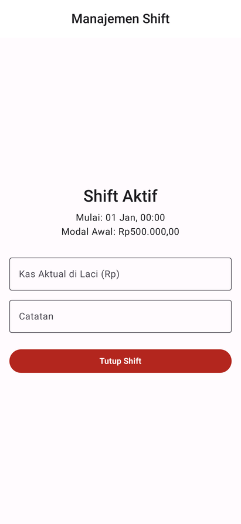 |

| Pembelian | Stok Opname | Expense | Riwayat Shift |
| --- | --- | --- | --- |
| 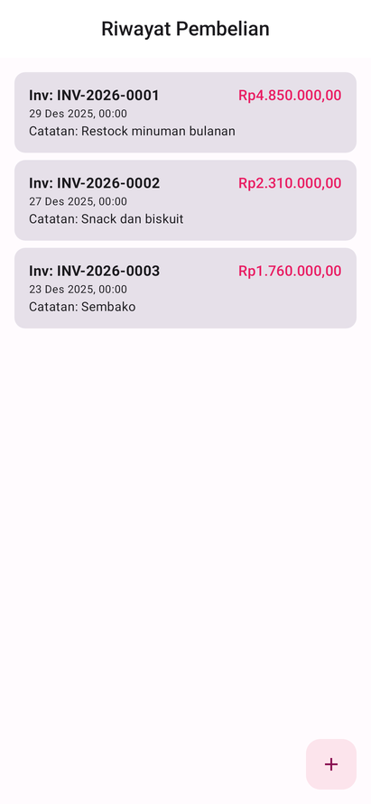 | 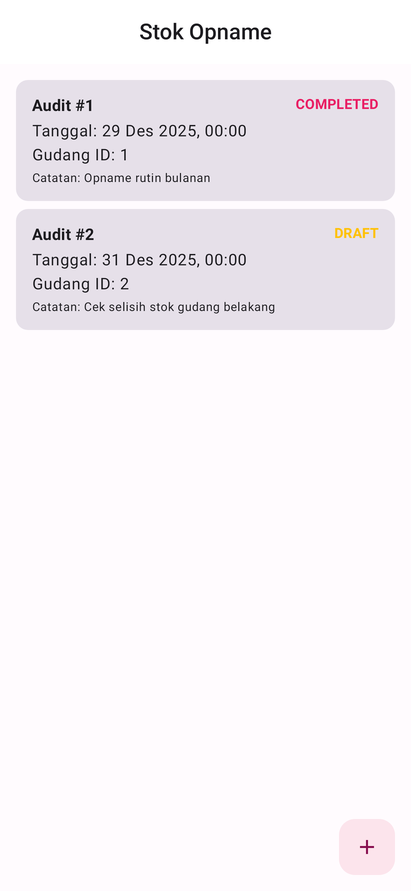 | 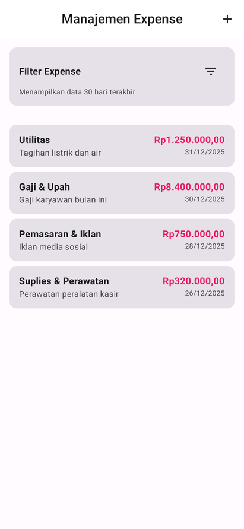 | 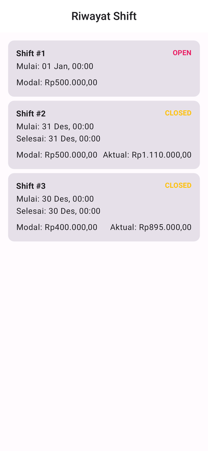 |

| Tambah Promosi | Tambah Pelanggan | Pembelian Baru | Mulai Opname |
| --- | --- | --- | --- |
| 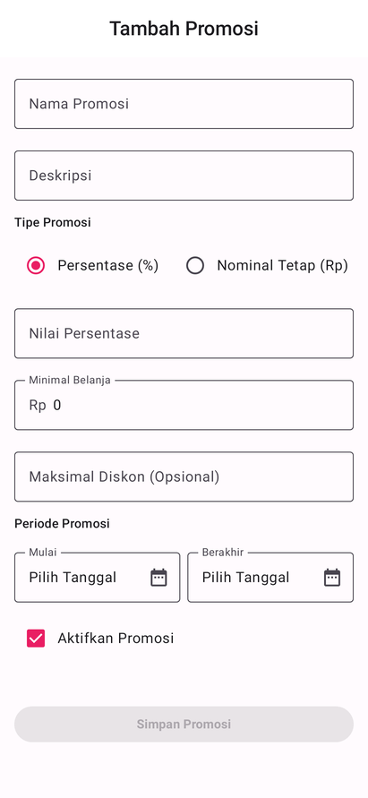 | 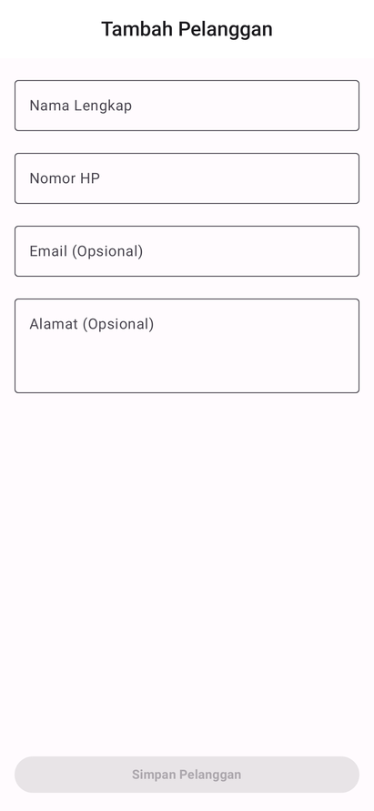 | 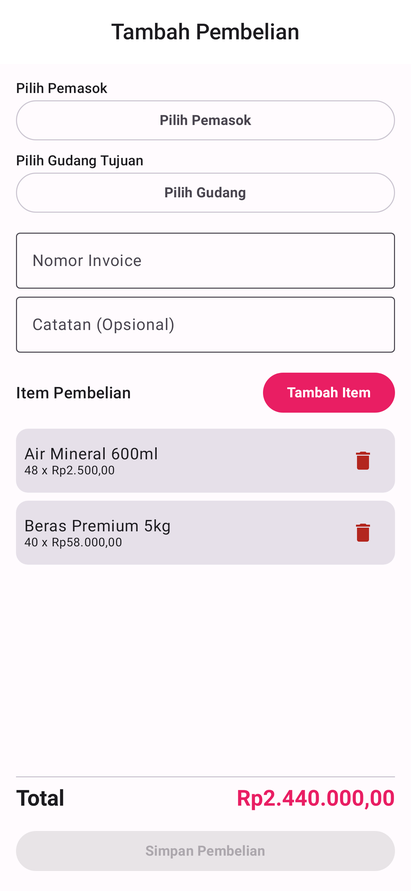 |  |

| Tambah Expense | Detail Expense |
| --- | --- |
| 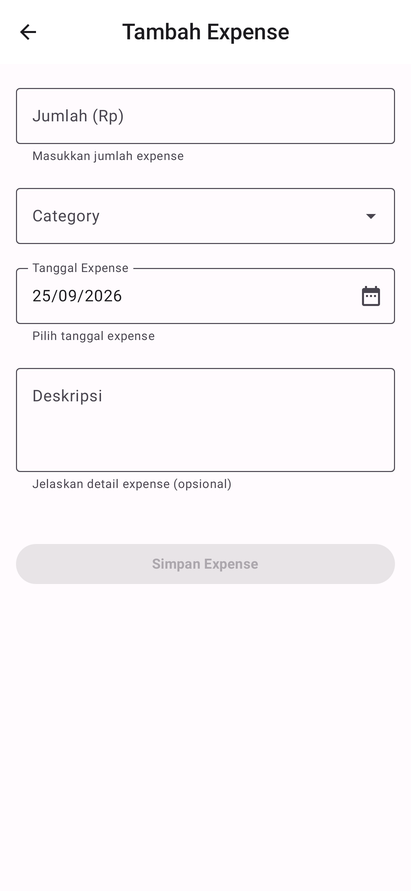 | 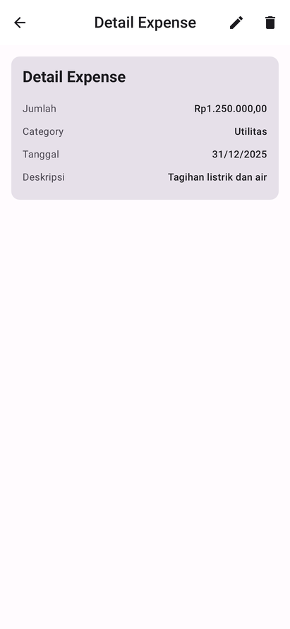 |

---

## 14. Penyelesaian Masalah

### 14.1 Masalah Umum

#### Aplikasi Lambat
**Penyebab:** Database terlalu besar atau memori penuh
**Solusi:**
1. Buat backup data
2. Clear cache aplikasi di Settings > Apps
3. Restart perangkat
4. Jika masih lambat, restore dari backup

#### Barcode Tidak Terbaca
**Penyebab:** Cahaya kurang atau barcode rusak
**Solusi:**
1. Pastikan pencahayaan cukup
2. Jaga jarak 15-20cm dari kamera
3. Coba scan ulang beberapa kali
4. Gunakan input manual sebagai alternatif

#### Printer Tidak Terhubung
**Penyebab:** Bluetooth tidak aktif atau printer tidak paired
**Solusi:**
1. Aktifkan Bluetooth di perangkat
2. Pair printer di Settings > Bluetooth
3. Pastikan printer menyala dan dalam jangkauan
4. Restart aplikasi dan coba lagi

#### Data Hilang
**Penyebab:** Crash aplikasi atau storage penuh
**Solusi:**
1. Cek folder Downloads/ChibyChibyBackup
2. Restore dari backup terakhir
3. Jika tidak ada backup, hubungi support

### 14.2 Error Messages

#### "Stok tidak mencukupi"
- Produk yang dipilih tidak memiliki stok cukup
- Periksa inventori dan update stok

#### "Barcode tidak valid"
- Format barcode tidak sesuai standar GS1
- Periksa dan generate ulang barcode

#### "Izin ditolak"
- User tidak memiliki izin untuk fitur tersebut
- Hubungi owner untuk upgrade peran

#### "Koneksi printer gagal"
- Periksa koneksi Bluetooth
- Restart printer dan aplikasi

---

## 15. FAQ

### Q: Apakah aplikasi bisa digunakan offline?
**A:** Ya, aplikasi dirancang offline-first. Semua fitur berfungsi tanpa internet.

### Q: Berapa maksimal produk yang bisa dikelola?
**A:** Tidak ada batas keras dari aplikasi. Database SQLite lokal sanggup menangani ribuan produk; performa bergantung pada perangkat.

### Q: Apakah data aman?
**A:** Data tersimpan lokal di perangkat (database SQLite belum terenkripsi). File backup terenkripsi AES-256-GCM dan hanya bisa dibuka oleh aplikasi ini.

### Q: Bagaimana cara backup data?
**A:** Buka halaman Backup & Restore dan klik "Buat Backup". File `.enc` tersimpan di folder `Downloads/ChibyChibyBackup`.

### Q: Format barcode apa yang didukung?
**A:** EAN-13, Code 128, QR Code, dan GS1 DataMatrix.

### Q: Bisakah digunakan di multiple device?
**A:** Saat ini single device dengan data lokal. Sinkronisasi multi-device belum tersedia.

### Q: Bagaimana cara reset password?
**A:** Owner dapat mereset password user lain melalui dialog "Reset Password" di halaman Manajemen User.

### Q: Apakah ada biaya langganan?
**A:** Tidak, aplikasi gratis untuk digunakan tanpa batas waktu.

---

## 16. Kontak Dukungan

### Dukungan Teknis
- **Email**: support@chibychibystore.com
- **WhatsApp**: +62 812-3456-7890
- **Website**: www.chibychibystore.com

### Waktu Operasional
- **Senin - Jumat**: 08:00 - 17:00 WIB
- **Sabtu**: 08:00 - 12:00 WIB
- **Minggu**: Tutup

### Cara Melaporkan Bug
1. Deskripsikan masalah secara detail
2. Sertakan screenshot jika memungkinkan
3. Sebutkan versi Android dan aplikasi
4. Kirim ke email support

---

**Terima kasih telah menggunakan Chiby Chiby Store!**

*Panduan ini akan diperbarui sesuai dengan pengembangan aplikasi. Versi terbaru selalu tersedia di website resmi.*