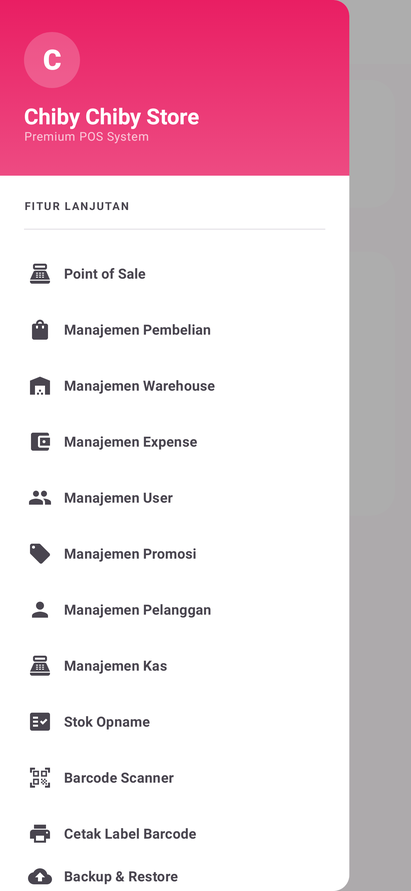
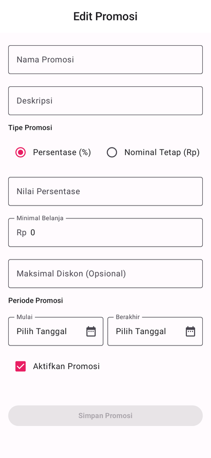
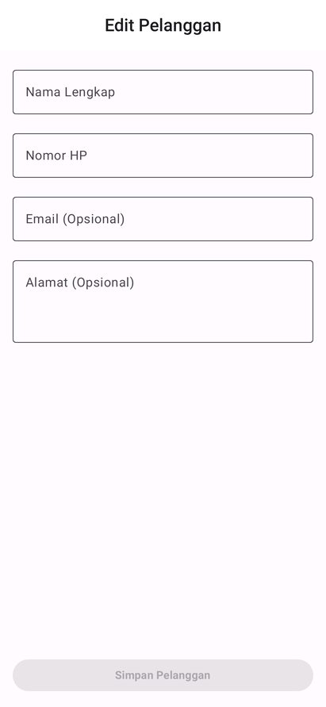

<p align="center">
  
</p>

# Chiby Chiby Store POS

A native Android Point of Sale (POS) and inventory management app for retail shops. Built with Jetpack Compose and an offline-first Room database, it runs a full counter operation — sales, stock, purchasing, cash, expenses, and reporting — without an internet connection.

<p align="center">
  
  
  
  
</p>

## Contents

- [Feature tour](#feature-tour)
- [Screenshots](#screenshots)
- [Tech stack](#tech-stack)
- [Architecture](#architecture)
- [Getting started](#getting-started)
- [Testing](#testing)
- [Regenerating the screenshots](#regenerating-the-screenshots)
- [Documentation](#documentation)
- [Project layout](#project-layout)
- [License](#license)

## Feature tour

- **Point of Sale** — cart-based checkout with product search, per-line discounts, cash/QRIS/card payment, receipt preview, and a share/print receipt flow.
- **Inventory** — products with categories, units, cost and selling prices, minimum-stock thresholds, plus per-warehouse stock levels and low-stock warnings.
- **Warehouses** — multiple locations with their own stock records, and transfers between them.
- **Purchasing** — supplier orders and goods receipt that increase stock on confirmation.
- **Customers & suppliers** — contact records with purchase history, linked to sales and purchases.
- **Promotions** — percentage or fixed-amount discounts with minimum-spend rules, optional caps, and an active date window.
- **Cash management** — shift open/close with an opening float, actual cash count, variance, and shift history.
- **Stock opname (audit)** — physical count sessions that record the difference against system stock and adjust it.
- **Expenses** — operating and capital expense entries with categories, plus filtering by period and category.
- **Reports** — twelve report types (gross sales, net profit, profit margin, sales trend, sales by product/category, stock movement, periodic summary, income statement, balance sheet, cash flow, expense) with date-range filters and PDF export.
- **User management** — role-based access control across owner, manager, cashier, and warehouse roles.
- **Barcode** — CameraX/ZXing scanning to add items to the cart, and label printing via ESC/POS thermal printers.
- **Backup & restore** — AES-256-GCM encrypted local backups.

## Screenshots

Every screen below is rendered by an automated Robolectric test, so the gallery always matches the current UI code. See [Regenerating the screenshots](#regenerating-the-screenshots).

### Authentication and dashboard

| Login | Dashboard | Navigation drawer |
| --- | --- | --- |
|  |  |  |

### Point of Sale

| Point of Sale | Payment / receipt dialog | Sales history | Sales receipt dialog |
| --- | --- | --- | --- |
|  |  |  |  |

### Inventory and warehouses

| Inventory list | Add product | Product detail |
| --- | --- | --- |
|  |  |  |

| Warehouse list | Warehouse detail | Add warehouse | Edit warehouse |
| --- | --- | --- | --- |
|  |  |  |  |

### Purchasing, promotions, and customers

| Purchase orders | New purchase | Promotion list | Add promotion |
| --- | --- | --- | --- |
|  |  |  |  |

| Edit promotion | Customer list | Add customer | Edit customer |
| --- | --- | --- | --- |
|  |  |  |  |

### Cash, stock opname, expenses, and backup

| Active shift | Shift history | Stock opname list | Start stock opname |
| --- | --- | --- | --- |
|  |  |  |  |

| Expense list | Add expense | Expense detail | Backup & restore |
| --- | --- | --- | --- |
|  |  |  |  |

### Users, suppliers, barcode, and settings

| User list | Add user | User detail | Delete user dialog |
| --- | --- | --- | --- |
|  |  |  |  |

| Supplier list | Barcode scanner | Print barcode labels | Settings |
| --- | --- | --- | --- |
|  |  |  |  |

### Reports

All twelve report types, rendered from the same report screen with a different report selected.

| Gross sales | Net profit | Profit margin | Sales trend |
| --- | --- | --- | --- |
|  |  |  |  |

| Sales by product | Sales by category | Stock movement | Periodic summary |
| --- | --- | --- | --- |
|  |  |  |  |

| Income statement | Balance sheet | Cash flow | Expense report |
| --- | --- | --- | --- |
|  |  |  |  |

## Tech stack

| Area | Choice |
| --- | --- |
| Language | Kotlin |
| UI | Jetpack Compose (Material 3) |
| Architecture | MVVM with a service layer |
| Dependency injection | Dagger Hilt 2.60.1 |
| Persistence | Room 2.8.4 (SQLite), offline-first |
| Async | Coroutines and Flow |
| Navigation | Navigation Compose 2.9.6 |
| Camera | CameraX + ZXing (barcode scanning) |
| Printing | ESC/POS thermal printer library |
| Security | AndroidX Security Crypto (AES-256-GCM backups) |
| Testing | JUnit 4, Mockito, Robolectric 4.16.1, Compose UI Test |
| Build | Gradle with the Android Gradle Plugin |

## Architecture

The app is split into three layers so that business rules stay testable without a device:

1. **UI (presentation)** — Composables render state and forward events. Each screen has a ViewModel exposing an immutable state object through `StateFlow`.
2. **Service (domain)** — Services hold the business logic and transaction boundaries: sales, purchasing, inventory, cash, reporting, users. ViewModels call services, never DAOs.
3. **Data** — Repositories over Room DAOs and entities, plus encrypted file storage for backups.

```
ui/            Composables, ViewModels, navigation graph, theme
service/       Domain services and report builders
data/          Room entities, DAOs, repositories, backup crypto
di/            Hilt modules
```

## Getting started

### Prerequisites

- Android Studio Ladybug (2024.2.1) or newer
- JDK 17
- Android SDK: compileSdk 36, targetSdk 35, minSdk 23

### Build and run

```bash
git clone https://github.com/analisaperlengkapan/chiby-chiby-store.git
cd chiby-chiby-store
./gradlew assembleDebug
```

Open the project in Android Studio and run it on an emulator or device (Shift+F10), or install the debug APK directly:

```bash
adb install -r app/build/outputs/apk/debug/app-debug.apk
```

The app ships with a Room database that seeds a default owner account on first launch. See [SETUP_DEPLOYMENT_GUIDE.md](SETUP_DEPLOYMENT_GUIDE.md) for signing, release builds, and deployment.

## Testing

Unit tests run on the JVM through Robolectric, so no emulator is required:

```bash
./gradlew testDebugUnitTest
```

This covers ViewModels, services, and repositories. The same task also contains the screenshot harness described below; it writes nothing unless you ask it to.

## Regenerating the screenshots

The gallery in this README is produced by `app/src/test/java/com/chibychibystore/screenshots`, which renders each screen with Robolectric in native graphics mode and writes a PNG per screen. Nothing is written during a normal test run — output requires the `screenshot.dir` system property.

```bash
./gradlew testDebugUnitTest \
  --tests "com.chibychibystore.screenshots.ScreenshotTest" \
  -Dscreenshot.dir=/tmp/shots
```

Key pieces:

- `ScreenshotHarness` boots the app theme, swaps one composable at a time into a shared host, draws the activity decor view into a bitmap, and composites any open Compose dialog (dialogs render in a separate window that Robolectric would otherwise miss).
- `ScreenshotCatalog` lists every capture. ViewModels are Mockito mocks fed fixed `StateFlow` sample data from `SampleData`, so screenshots are deterministic and never touch the database.
- `ScreenshotTest` runs the catalog.

To refresh the README images after changing the UI, rerun the command above and copy the PNGs into `docs/screenshots/`:

```bash
python3 - <<'PY'
from PIL import Image
import glob, os
os.makedirs("docs/screenshots", exist_ok=True)
for f in sorted(glob.glob("/tmp/shots/*.png")):
    im = Image.open(f).convert("RGB")
    w, h = im.size
    im.resize((411, int(h * 411 / w)), Image.LANCZOS).save(
        os.path.join("docs/screenshots", os.path.basename(f)), optimize=True
    )
PY
```

If you add a screen, add a matching capture to `ScreenshotCatalog.captureAll()` and a row in the gallery above so the two stay in sync.

## Documentation

| Document | What it covers |
| --- | --- |
| [PANDUAN_PENGGUNA.md](PANDUAN_PENGGUNA.md) | End-user guide in Indonesian, walkthrough of every feature |
| [API_DOCUMENTATION.md](API_DOCUMENTATION.md) | Services, repositories, and data models |
| [SETUP_DEPLOYMENT_GUIDE.md](SETUP_DEPLOYMENT_GUIDE.md) | Environment setup, signing, release, deployment |
| [TROUBLESHOOTING_GUIDE.md](TROUBLESHOOTING_GUIDE.md) | Common failures and how to resolve them |
| [AGENTS.md](AGENTS.md) | Notes for AI coding agents working in this repository |

## Project layout

```
app/src/main/java/com/chibychibystore/
  ui/           Screens, ViewModels, navigation, theme, shared components
  service/      Business logic and report generation
  data/         Room entities/DAOs/repositories, encrypted backup
  di/           Hilt modules
app/src/test/java/com/chibychibystore/
  screenshots/  Robolectric screenshot harness and catalog
  ...           Unit tests for ViewModels, services, repositories
docs/screenshots/  Gallery images referenced by this README
```

## License

Proprietary software. All rights reserved.
